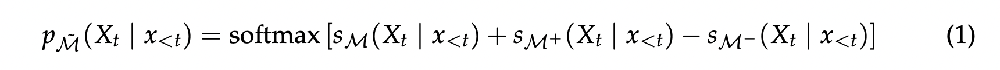

# Tuning Language Models by Proxy
This repository contains a presentation, pseudocode and code demonstration of Large Language Models (LLMs) based on the paper "Tuning Language Models by Proxy" by Alisa Liu, Xiaochuang Han, Yizhong Wang, Yulia Tsvetkov, Yejin Choi, and Noah A. Smith. Here is the [link](https://arxiv.org/abs/2401.08565) to the paper.
  
Presenter: Yitian(Ewan) Long & Yunfei Lyu
  
## Table of Contents
- [Overview](#overview)
    - [Introduction](#introduction)
    - [Characterized Approach](#characterized-approach)
- [Methodology](#methodology)
- [Discussion Question for the Class](#discussion-question-for-the-class)
    - [question #1](#question-1)
- [Experiments](#experiments)
- [Pseudocode](#pseudocode)
- [Code Demonstration](#code-demonstration)
- [Critical Analysis](#critical-analysis)
    - [Overlooked Aspects by the Authors](#overlooked-aspects-by-the-authors)
        - [Model Upper Limit](#model-upper-limit)
    - [Areas for Further Development](#areas-for-further-development)
        - [Delving into the "Black Box"](#delving-into-the-black-box)
        - [Resolving Conflicts Between Multiple Experts](#resolving-conflicts-between-multiple-experts)
- [Conclusion & Discussion](#conclusion--discussion)
- [Additional Resources](#additional-resources)
- [Citation](#citation)
  
## Overview
### Introduction
While the increasingly general capabilities of large language models (LLMs) have led to their widespread use, they still benefit from additional finetuning on specific tasks to achieve better performance. However, the finetuning process is often expensive and time-consuming, or impossible when model weights are private (e.g., GPT-4; OpenAI, 2023).
  
In this paper, the authors propose a new approach, *proxy-tuning*, which is a lightweight, decoding-time algorithm. This method allows for the adjustment of a large, black-box language model (LM) by utilizing the predictions from a lightweight model that operates on top of the LLM. The authors demonstrate that proxy-tuning can achieve competitive performance with traditional finetuning methods, while being more efficient and privacy-preserving, and can be used to tune LLMs without accessing their weights.
  
### Characterized Approach
Proxy-tuning incorporates a fine-tuned smaller model (the expert) and its untuned equivalent (the anti-expert) to guide the output of a larger base language model (LM) without altering the original model's parameters. 
  
- **Leveraging Smaller Models:** Employing a fine-tuned expert model alongside an untuned anti-expert model. The expert encapsulates the specific enhancements or knowledge from fine-tuning, while the anti-expert provides a baseline reference. These models are significantly smaller, making them less resource-intensive to fine-tune and manage.

- **Steering the Larger Model Efficiently:** By applying the differences in predictions between the expert and anti-expert to the base model's predictions, proxy-tuning steers the larger model towards the desired behavior at decoding time, leveraging the computational efficiency and flexibility of not having to retrain or modify the base model.

- **Applying Adjustments while Preserving Privacy:** Proxy-tuning shifts the original predictions of the larger model in the direction of the difference that results from tuning by not requiring access to the internal weights of the larger model.

## Methodology

The goal is to adjust the outputs of a large language model (referred to as M) by using two smaller models:

- An expert model (M+): This model has been fine-tuned to be good at a certain task.
- An anti-expert model (M−): This model has been fine-tuned to produce the opposite of the desired outcome.
Both M+ and M− are smaller and easier to fine-tune than the large model M.

Here's how it works:

- When  give an input xt(like a sentence or question) to the model,  also pass it to both M+ and M−.
- M+ and M− process the input and produce a set of scores for all possible outputs (like words or phrases that could come next).
- M+’s scores are added to M’s original scores, and - M−’s scores are subtracted from them. This is like saying, “Give me more of what M+ suggests and less of what M− doesn’t want.”
- After adjusting M’s scores with the scores from M+ and M−, the model uses a function called "softmax" to turn these scores into probabilities, which determines the likelihood of each possible output being the correct one.

This method effectively "steers" the large model to produce outputs more like what we want (based on M+) and avoid what we don’t want (based on M−), without having to go through the costly process of fine-tuning M directly.

## Discussion Question for the Class
### question #1 
Is there any backpropagation happening?

Answer

 
No, backpropagation is not needed for proxy tuning. Proxy tuning adjusts the behavior of a large pre-trained model by using the outputs of smaller models, often referred to as experts and anti-experts, at inference time without changing the parameters of the original large model. This approach essentially steers the output of the large model using the predictions from the smaller models, so the costly and time-consuming backpropagation process used in traditional fine-tuning to update model weights is not required. By the way fine-tune does involved if we need to fine-tune the M+ expert model by ourselves.

## Critical Analysis
### Overlooked Aspects by the Authors
#### Model Upper Limit
The paper does not fully address the inherent limitations of the base large language model (LLM). It posits that Proxy-Tuning can effectively steer the output of the LLM towards the desired knowledge domain. However, it underestimates the "upper limit" of the LLM's capability. If the base model cannot generate the correct answer within a reasonable number of attempts, the effectiveness of logit adjustment becomes negligible. This suggests a need for clearer acknowledgment of the base model's knowledge constraints.

### Areas for Further Development
#### Delving into the "Black Box"
While the paper endeavors to understand the reasoning behind knowledge transfer at the token level. There is an opportunity for more extensive research to decipher the underlying mechanisms of Proxy-Tuning. A deeper investigation into the "black box" of neural networks could reveal how information flows and transforms, leading to a richer comprehension of the model's behavior and potentially unlocking new methodologies for model steering.

#### Resolving Conflicts Between Multiple Experts
The combination of different domain-specific experts in Proxy-Tuning raises questions about potential errors and conflicts in guidance. The current paper does not explore the scenario where multiple expert models may provide conflicting adjustments to the base LLM. This could lead to a compromised or confused model output. Future research could develop a framework for conflict resolution or a harmonious integration of insights from multiple experts, enhancing the robustness of the Proxy-Tuning approach.
