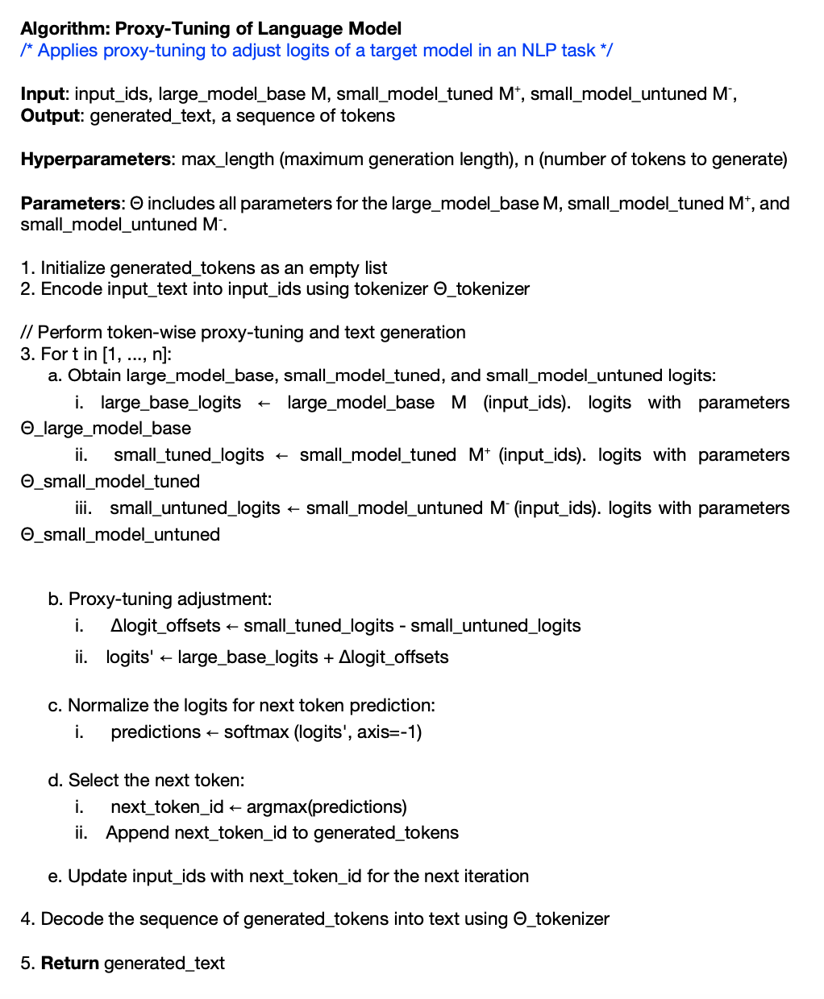

# Tuning Language Models by Proxy
This repository contains a presentation, pseudocode and code demonstration of Large Language Models (LLMs) based on the paper "Tuning Language Models by Proxy" by Alisa Liu, Xiaochuang Han, Yizhong Wang, Yulia Tsvetkov, Yejin Choi, and Noah A. Smith. Here is the [link](https://arxiv.org/abs/2401.08565) to the paper.
  
Presenter: Yitian(Ewan) Long & Yunfei Lyu
  
## Table of Contents
- [Overview](#overview)
    - [Introduction](#introduction)
    - [Characterized Approach](#characterized-approach)
- [Methodology](#methodology)
    - [Build Expert and Anti-Expert Models](#build-expert-and-anti-expert-models)
    - [Question 1](#question-1)
    - [Calculation of the logit scores at each time step](#calculation-of-the-logit-scores-at-each-time-step)
    - [Question 2](#question-2)
- [Experiments](#experiments)
    - [Instruction-Tuning Experiments](#instruction-tuning-experiments)
   - [Code Adaptation Experiments](#code-adaptation-experiments)
    - [Results Overview](#results-overview)
    - [Summary](#summary)
- [Pseudocode](#pseudocode)
- [Code Demonstration](#code-demonstration)
- [Critical Analysis](#critical-analysis)
    - [Overlooked Aspects by the Authors](#overlooked-aspects-by-the-authors)
        - [Model Upper Limit](#model-upper-limit)
    - [Areas for Further Development](#areas-for-further-development)
        - [Delving into the "Black Box"](#delving-into-the-black-box)
        - [Resolving Conflicts Between Multiple Experts](#resolving-conflicts-between-multiple-experts)
- [Conclusion & Discussion](#conclusion--discussion)
- [Additional Resources](#additional-resources)
- [Citation](#citation)
  
## Overview
### Introduction
While the increasingly general capabilities of large language models (LLMs) have led to their widespread use, they still benefit from additional finetuning on specific tasks to achieve better performance. However, the finetuning process is often expensive and time-consuming, or impossible when model weights are private (e.g., GPT-4; OpenAI, 2023).
  
In this paper, the authors propose a new approach, *proxy-tuning*, which is a lightweight, decoding-time algorithm. This method allows for the adjustment of a large, black-box language model (LM) by utilizing the predictions from a lightweight model that operates on top of the LLM. The authors demonstrate that proxy-tuning can achieve competitive performance with traditional finetuning methods, while being more efficient and privacy-preserving, and can be used to tune LLMs without accessing their weights.
  
### Characterized Approach
Proxy-tuning incorporates a fine-tuned smaller model (the expert) and its untuned equivalent (the anti-expert) to guide the output of a larger base language model (LM) without altering the original model's parameters. 
  
- **Leveraging Smaller Models:** Employing a fine-tuned expert model alongside an untuned anti-expert model. The expert encapsulates the specific enhancements or knowledge from fine-tuning, while the anti-expert provides a baseline reference. These models are significantly smaller, making them less resource-intensive to fine-tune and manage.

- **Steering the Larger Model Efficiently:** By applying the differences in predictions between the expert and anti-expert to the base model's predictions, proxy-tuning steers the larger model towards the desired behavior at decoding time, leveraging the computational efficiency and flexibility of not having to retrain or modify the base model.

- **Applying Adjustments while Preserving Privacy:** Proxy-tuning shifts the original predictions of the larger model in the direction of the difference that results from tuning by not requiring access to the internal weights of the larger model.

## Methodology

### Build Expert and Anti-Expert Models

The goal is to adjust the outputs of a large language model (referred to as M) by using two smaller models:

- An expert model (M+): Suppose we have a small pretrained model M-, which we will tune directly to obtain M+. This M+ model has been fine-tuned to be good at a certain task.
- An anti-expert model (M−): This model is the same as M+ but has not been fine-tuned. M- does not need to be in the same model family as M, but it should share the same vocabulary with M.

**Logits** refer to the unnormalized unnormalized scores just before the final layer, which is the model's raw output values before being transformed into probabilities by an activation function like softmax.

**Decoding-time experts** (Liu et al., 2021) is a specific strategy involves dynamically incorporating external knowledge or specific guidance during the model's decoding phase to influence the generated outputs, where this guidance often comes from other pretrained models, referred to as "experts". A common method is to adjust the **logits** of the generated words at decoding time, which can dynamically increasing or decreasing the probability of certain words based on the outputs of expert models.

For here, we apply decoding-time experts, Proxy-tuning operates on M's output distribution over next word by adding a logit offest for every token, determined by the difference between logits from M- and M+.

### Question 1
Why we call the model M+ as expert model and M- as anti-expert model?

Answer

 
The expert model (M+)'s logits are additively combined and the anti-expert model (M-)'s logits are negatively combined with the base model M's logits.

### Calculation of the logit scores at each time step

At each time step $t$, we condition the base model $M$, the expert $M+$, and the anti-expert $M-$ on the prompt x&lt;t, to obtain the logit scores $S_M$, $S_{M+}$, and $S_{M-}$, respectively.

Here's how it works:

- When  give an input $xt$(like a sentence or question) to the model,  also pass it to both $M+$ and $M−$.
- $M+$ and $M−$ process the input and produce logit scores for all possible outputs (like words or phrases that could come next).
- the offset logit scores of the learned difference between $M-$ and $M+$ are applied to $M$’s original logit scores. This is like saying, “Give me more of what M+ suggests and less of what M− doesn’t want.”
- After adjusting $M$’s logit scores with the scores from $M+$ and $M−$, the model uses softmax function to turn these scores into probabilities, which determines the likelihood of each possible output being the correct one.

### Question 2
Is there any backpropagation happening?

Answer

 
No, backpropagation is not needed for proxy tuning. Proxy tuning adjusts the behavior of a large pre-trained model by using the outputs of smaller models, often referred to as experts and anti-experts, at inference time without changing the parameters of the original large model. This approach essentially steers the output of the large model using the predictions from the smaller models, so the costly and time-consuming backpropagation process used in traditional fine-tuning to update model weights is not required. By the way fine-tune does involved if we need to fine-tune the M+ expert model by ourselves.

## Experiments

### Instruction-Tuning Experiments
Base Model ($M$): steer 13B- and 70B-BASE
Expert Model ($M+$): 7B-CHAT
Anti-Expert Model ($M-$): 7B-BASE

Datasets: The evaluation involves four datasets: GSM for arithmetic word problems, AlpacaFarm for open-ended instructions, Toxigen for assessing model responses to hateful statements, and TruthfulQA for handling misleading questions.

Results: The method effectively closes the performance gap between untuned base models and their tuned CHAT counterparts by a significant margin.

### Code Adaptation Experiments
This section refined the approach to training language models for code-related tasks. Here's a brief on the models used:

Base model (7B-CODE): Considered the domain expert (M+), this model is a specialized version of the original LLAMA2-7B, fine-tuned for Python code generation.

Counterfactual (7B-BASE): This model serves as the non-expert (M-), the original LLAMA2-7B before any specialized training on code.

#### Results Overview

Figure: Highlighted results from Table 4 - Pay special attention to "7B Directly tuned" and the lower "Proxy-tuning" score for the 13B model.

the models were tested on the Pass@10 metric, which evaluates whether at least one correct answer is produced in ten attempts. Here's what we found:

- 7B Directly Tuned: This model achieved 68.9% on CodexEval and 53.6% on DS-1000, surpassing its proxy-tuned counterpart.

- 13B Proxy-Tuned: Despite the larger size, the proxy-tuned 13B model scored lower than the directly tuned 7B, with 65.7% on CodexEval and 42.8% on DS-1000.

#### Summary 
Normally, we'd expect a larger model to perform better due to more capacity for learning and understanding complex patterns, but the results suggest that just scaling up the model size does not guarantee better performance when it comes to proxy-tuning. It could be that the specific expertise developed in the smaller model doesn't transfer as effectively when scaled up through proxy-tuning. larger pretraining scale means that for general tasks, having a larger model usually provides more knowledge and better performance. But when a smaller model has been specifically tuned for a task (like the CODELLAMA-7B-PYTHON has been for Python code), simply having a larger model does not automatically mean better performance in that narrow domain.

## Pseudocode

## Code Demonstration
google colab: https://colab.research.google.com/drive/163mpohPGnOkEatj_TE5ei_kZMXvuLMDA#scrollTo=DgerY98rlD7F

## Critical Analysis
### Overlooked Aspects by the Authors
#### Model Upper Limit
The paper does not fully address the inherent limitations of the base large language model (LLM). It posits that Proxy-Tuning can effectively steer the output of the LLM towards the desired knowledge domain. However, it underestimates the "upper limit" of the LLM's capability. If the base model cannot generate the correct answer within a reasonable number of attempts, the effectiveness of logit adjustment becomes negligible. This suggests a need for clearer acknowledgment of the base model's knowledge constraints.

### Areas for Further Development
#### Delving into the "Black Box"
While the paper endeavors to understand the reasoning behind knowledge transfer at the token level. There is an opportunity for more extensive research to decipher the underlying mechanisms of Proxy-Tuning. A deeper investigation into the "black box" of neural networks could reveal how information flows and transforms, leading to a richer comprehension of the model's behavior and potentially unlocking new methodologies for model steering.

#### Resolving Conflicts Between Multiple Experts
The combination of different domain-specific experts in Proxy-Tuning raises questions about potential errors and conflicts in guidance. The current paper does not explore the scenario where multiple expert models may provide conflicting adjustments to the base LLM. This could lead to a compromised or confused model output. Future research could develop a framework for conflict resolution or a harmonious integration of insights from multiple experts, enhancing the robustness of the Proxy-Tuning approach.

## Additional Resources

- GitHub Repository for Proxy Tuning: https://github.com/alisawuffles/proxy-tuning
- There is a method that is also aim to steer a model's behavior without extensive retraining or fine-tuning. While proxy tuning adjusts the output distribution, steering vectors manipulate the model's internal state. https://www.lesswrong.com/tag/activation-engineering contains a good survey of the ideas and results
- Code example for Proxy tuning: https://lightning.ai/lightning-ai/studios/improve-llms-with-proxy-tuning
- A deep dive into the paper "Tuning Language Models by Proxy", offering a clear explanation of the process and the benefits of proxy tuning​. https://foundationflow.ai/tune-language-models-with-proxy-tuning/
- Explore a valuable discussion on Reddit about the paper: https://www.reddit.com/r/LocalLLaMA/comments/19dg8pk/new_paper_proxytuning_an_efficient_alternative_to/

## Citation
1. Liu, A., Han, X., Wang, Y., Tsvetkov, Y., Choi, Y., & Smith, N. A. (2024). Tuning language models by proxy. arXiv preprint arXiv:2401.08565.

2. Liu, A., Sap, M., Lu, X., Swayamdipta, S., Bhagavatula, C., Smith, N. A., & Choi, Y. (2021). DExperts: Decoding-time controlled text generation with experts and anti-experts. arXiv preprint arXiv:2105.03023.
